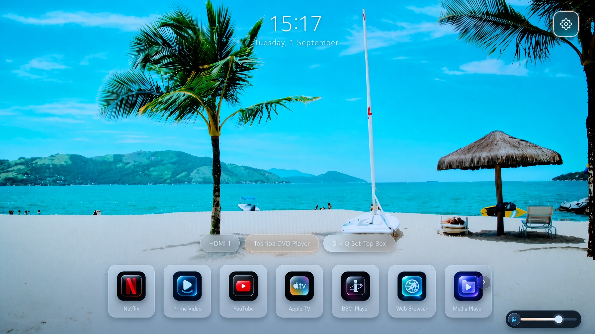
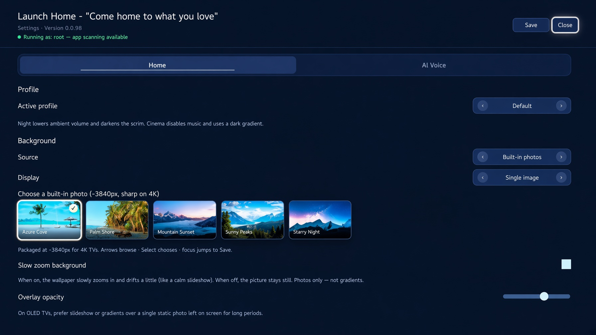

# webOS Launch Home

A fullscreen home screen for rooted LG webOS TVs. Pick an app, switch inputs, and enjoy ambient background music — without the stock launcher clutter.





## Features

- App grid with pinned streaming apps, plus custom app tiles (pin any installed app by App ID with a bundled icon)
- HDMI and TV input shortcuts with custom labels (uncheck all inputs to hide the row entirely)
- Scenic backgrounds (built-in, USB, or **online nature + anime URLs** — no extra images in the IPK) and built-in ambient music that keeps playing while settings are open
- Large centered clock with optional date, both independently toggleable
- Compact volume control; optional music bar (track name) in Settings
- TV system volume levels for Launch Home vs when apps launch
- Adjustable icon size and left/center/right icon alignment
- Dedicated app settings button and a TV Settings tile for quick access to system settings
- **Launch on Home button** — root watcher reopens Launch Home when stock Home appears
- **Boot on TV start** — root init.d script launches Launch Home after power-on
- **Voice (optional)** — if a separate voice service is installed, the Magic Remote Voice button can open apps (see [Voice](#voice) below)
- Remote-friendly navigation

## Voice

Launch Home is a standalone home screen. Voice is optional and lives in a **separate** installed service (not part of this app).

### Setup

1. **Disable LG’s own voice UI** so it does not steal the Voice button:  
   **General → AI Service → Voice Recognition Settings → Disable AI Voice Recognition**
2. Install and run your voice service on the TV (this repo does not include it).
3. In **Launch Home → Settings → AI Voice**, enter your **Grok (xAI) API key** and Save.
4. Hold the Magic Remote **Voice** button and speak. A small **mic badge** appears top-right while listening; then the app opens or the TV responds.

### What you can say

**Apps:** “Launch Netflix”, “Open YouTube”, “Open Prime”, “Open Disney”, “Open Spotify”, “Open browser”, “Open terminal”, “Open settings”, “Open Live TV” — or “Open …” / “Launch …” plus any installed app name. Also: “Open Launch Home”, “Go home”, “Home screen”.

**Volume & inputs:** “Mute”, “Unmute”, “Volume up”, “Volume down”, “Set volume to 15”, “HDMI 1”, “Switch to HDMI 2”, “Live TV”, “Go home”, “Channel up”, “Turn off the TV”, “Sleep timer 30 minutes”, “Subtitles on”.

Short, clear phrases work best. Voice features need a rooted TV, a separate voice service running, and a valid API key.

## Compatibility

| webOS version | Status | Notes |
| --- | --- | --- |
| webOS 25 (sdk ~10) | Working | Primary test platform — LG OLED55C56LB |
| webOS 6–9 / 22–24 | Expected working | Same Luna APIs as 25; not fully regression-tested here |
| webOS 5.x | Expected working | Use project-local `@webos-tools/cli` for packaging (epoch tar fix) |
| webOS 4.x | Working (reported) | Home watcher + boot-on-start use webOS 4–safe `luna-send` fallbacks; backgrounds viewable on device (see below) |

**Requirements:** rooted TV with [Homebrew Channel](https://github.com/webosbrew/webos-homebrew-channel) and SSH. Root elevation is required for full app scanning, Home-button intercept, and boot-on-start.

### webOS 4.x notes

- **Background JPEGs on device.** Built-in scenic images ship inside the app package. On webOS 4 you can browse them directly under:

  ```text
  /media/developer/apps/usr/palm/applications/org.webosbrew.lounge.launcher/assets/backgrounds/
  ```

  (Some file managers list this as `…/assets/background`.)

- **Online backgrounds.** Settings → Background → **Online URL (nature + anime)** opens a thumbnail gallery of curated Unsplash nature photos plus popular free anime-style wallpapers (or paste your own https image URL). Photos load over the network so the package stays small. See [docs/background-sources.md](docs/background-sources.md).

- **Home button / Boot on start.** Both install hooks under `/var/lib/webosbrew/init.d/` via the elevated Homebrew Channel service. Toggle the setting **off → Save → on → Save** after an update if either stops working. Confirm Homebrew startup is installed (see [Running elevated as root](#running-elevated-as-root-required-for-app-scanning)).

## Install

Requires a rooted LG TV with [Homebrew Channel](https://github.com/webosbrew/webos-homebrew-channel) and SSH enabled.

```bash
npm install
./install2tvfrommacos.sh
```

Set your TV's IP if needed:

```bash
TV_IP=192.168.0.79 ./install2tvfrommacos.sh
```

Or build manually:

```bash
npm run pack
ares-install --device webos dist/*.ipk
```

`npm run pack` uses the project-local `@webos-tools/cli` and rejects files dated `1970-01-01`. That epoch stamp is a `@webosose/ares-cli` + Node.js 22+ bug; some TVs (webOS 5) refuse to install those packages. Do not package with `@webosose/ares-cli` on modern Node.

## Running elevated as root (required for app scanning)

**Why this is required.** Retail webOS only returns the *full* list of installed
apps (`luna://com.webos.applicationManager/listApps`) to **privileged (root)
clients**. A normal sandboxed web app can only see its own launch points, so the
built-in **Scan for apps** feature returns nothing unless the launcher runs with
elevated (root) Luna privileges. On a rooted TV that elevation is provided by the
[Homebrew Channel](https://github.com/webosbrew/webos-homebrew-channel) root
service (`luna://org.webosbrew.hbchannel.service/exec`), which executes as root.

Home-button intercept and Boot on TV start use the same root service to install
`/var/lib/webosbrew/init.d/` hooks.

### 1. Elevate (grants root)

SSH into the TV (the installer already provisions `root@TV_IP` key auth) and run
the Homebrew Channel elevation helper:

```bash
ssh root@TV_IP
/media/developer/apps/usr/palm/services/org.webosbrew.hbchannel.service/elevate-service
```

### 2. Persist across reboots and app updates

Copy the Homebrew Channel startup script into the boot location so elevation is
re-applied automatically on every boot:

```bash
cp /media/developer/apps/usr/palm/services/org.webosbrew.hbchannel.service/startup.sh \
   /var/lib/webosbrew/startup.sh
```

This lives **outside** the app directory
(`/media/developer/apps/usr/palm/applications/org.webosbrew.lounge.launcher`), so
reinstalling or updating the Launch Home `.ipk` does **not** remove it —
root elevation survives app updates.

### 3. (Optional) Force re-elevation on every boot

Homebrew Channel runs any executable placed in `/var/lib/webosbrew/init.d` at
boot as root. Add a hook so the service is always re-elevated after an update:

```bash
mkdir -p /var/lib/webosbrew/init.d
cat > /var/lib/webosbrew/init.d/30-lounge-elevate <<'EOF'
#!/bin/sh
/media/developer/apps/usr/palm/services/org.webosbrew.hbchannel.service/elevate-service
EOF
chmod +x /var/lib/webosbrew/init.d/30-lounge-elevate
```

> Note: A full **TV firmware update** can reset root. If app scanning stops
> working after a system update, re-root the TV / reinstall Homebrew Channel and
> repeat steps 1–2.

## License

MIT
